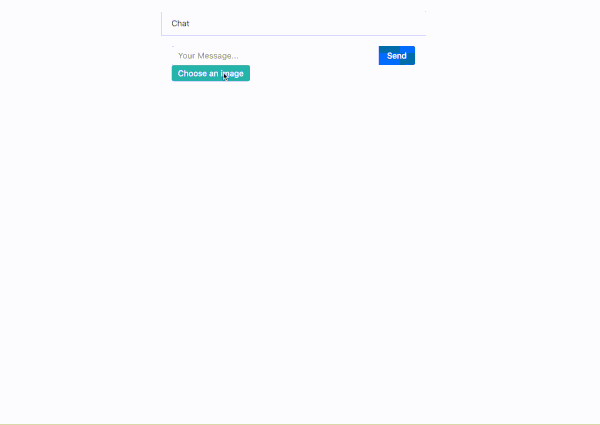
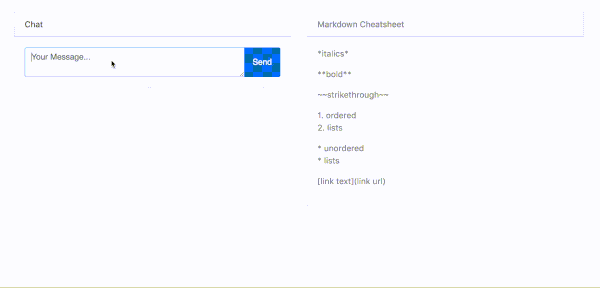
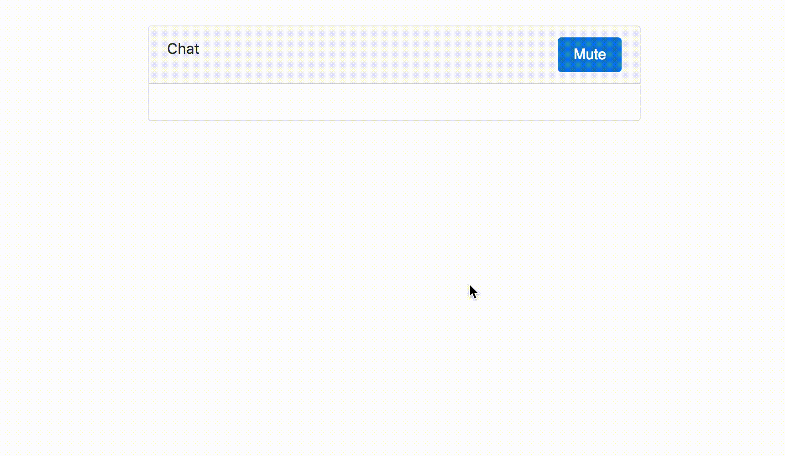
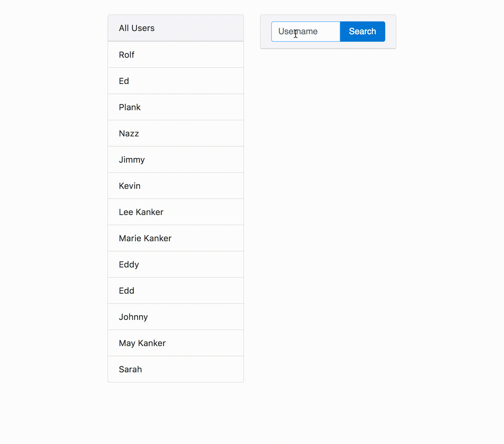

PubNub ChatEngine is an object oriented event emitter based framework for building chat applications in Javascript. It reduces the time to build chat applications drastically and provides essential components like typing indicators, online presence monitoring and message history out of the box.

The real time server component is provided by PubNub. ChatEngine is designed to be extensible and includes a plugin framework to make adding new features simple.

[](https://www.jsdelivr.com/package/npm/chat-engine)
[](https://travis-ci.org/pubnub/chat-engine)
[](https://www.codacy.com/app/PubNub/chat-engine?utm_source=github.com&utm_medium=referral&utm_content=pubnub/chat-engine&utm_campaign=badger)
[](https://www.codacy.com/app/PubNub/chat-engine?utm_source=github.com&utm_medium=referral&utm_content=pubnub/chat-engine&utm_campaign=badger)

# Browser Support

ChatEngine is compiled with babel and supports [these browsers](http://browserl.ist/?q=defaults) and [create-react-app](https://github.com/facebook/create-react-app).

# Getting Started

Check out [the getting started guide](https://github.com/pubnub/chat-engine-tutorial).

## Videos

* [ChatEngine Intro](https://www.youtube.com/watch?v=o529w2ABH6s)
* [5 Minute ChatEngine Tutorial](https://www.youtube.com/watch?v=sUUekUsfed4)
* [Chat in 30 Lines of Code Webinar](https://www.youtube.com/watch?v=jnF9fLo7xfk)

# Docs

You can find the full docs on [the full documentation website](https://www.pubnub.com/docs/chat-engine/getting-started). Concepts are linked below for convenience.

# Concepts

* [Me](https://www.pubnub.com/docs/chat-engine/me) - It's you dummy. The user that represents the current application.
* [Users and State](https://www.pubnub.com/docs/chat-engine/users-and-state) - Explains how to interact with other users using ChatEngine and get additional information about them.
* [Chats](https://www.pubnub.com/docs/chat-engine/chats) - ChatEngine's bread and butter. These are isolated rooms that users can talk to each other in.
* [Events](https://www.pubnub.com/docs/chat-engine/events) - Events are things that happen in a chat. Like ```message``` or ```image_upload``` for example.
* [Event Payload](https://www.pubnub.com/docs/chat-engine/event-payload) - The data that comes with an event. Includes things like who sent the event and what chat it was sent to.
* [Namespaces](https://www.pubnub.com/docs/chat-engine/namespaces) - ChatEngine has a lot of events, so we use name spacing to isolate them.
* [Wildcards](https://www.pubnub.com/docs/chat-engine/wildcards) - Get all the events of a single namespace, like $.online.* to get all types of online events.
* [Search](https://www.pubnub.com/docs/chat-engine/search) - Retrieve old events that happened in the past. Usually done when your application boots up to show what happened before.
* [Global Chat](https://www.pubnub.com/docs/chat-engine/global-chat) - The chat that all users connect to. It's used for state management and application wide events.
* [Online List](https://www.pubnub.com/docs/chat-engine/online-list) - Get all the users online in the chat room.
* [Authentication](https://www.pubnub.com/docs/chat-engine/authentication) - How to use auth keys to identify your users and protect access to channels.
* [Privacy](https://www.pubnub.com/docs/chat-engine/privacy) - Every user has a special feed chat that only they can publish to, and a direct chat that nobody else can read from. Outlines other ways of handling permissions as well.
* [Private Chats](https://www.pubnub.com/docs/chat-engine/private-chat) - Create private chats that nobody else can join.
* [Templating](https://www.pubnub.com/docs/chat-engine/templating) - How ChatEngine works with other frameworks like React, Angular, jQuery, and plain ol' Javascript.
* [Errors](https://www.pubnub.com/docs/chat-engine/errors) - Sometimes things don't go as planned, here's how you can catch errors gracefully.
* [Debugging](https://github.com/pubnub/chat-engine/blob/master/guide/concepts/events/debugging.md) - How to use the built-in utilities for logging events and network requests.
* [Plugins](https://www.pubnub.com/docs/chat-engine/plugins) - Drop in extra functionality, like emojii or typing indicators with plugins.
* [Building a Plugin](https://www.pubnub.com/docs/chat-engine/build-a-plugin) - If what you need doesn't exist, it's easy to build yourself. Share it with us!
* [PubNub Functions](https://www.pubnub.com/docs/chat-engine/pubnub-functions) - ChatEngine uses PubNub functions as a server component and details about that can be found here.
* [PubNub Channel Topology](https://www.pubnub.com/docs/chat-engine/pubnub-channel-topology) - Describes what PubNub channels ChatEngine is using under the hood.

# Resources

## Javascript

* [Chat](https://github.com/pubnub/chat-engine-examples/blob/master/javascript/chat.html) - Really simple chat example. The "hello world" of ChatEngine.
* [Online List](https://github.com/pubnub/chat-engine-examples/blob/master/javascript/online-list.html) - No chats, just renders who is online. See the Kitchen Sinks for how to combine this with private chats.

## React Native + Mobile

* [React Native Example](https://github.com/pubnub/chat-engine-examples/tree/master/react-native) - Made with ```create-react-app```.
* [React Native Components](https://github.com/pubnub/chat-engine-react-native) - Premade components for rendering Chats, Messages, Users, and more.
* [Integrating into an existing iOS App](https://www.pubnub.com/docs/chat-engine/samples/ios) - Guide on adding ChatEngine React native app into iOS.
* [Integrating into an existing Android App](https://www.pubnub.com/docs/chat-engine/samples/android) - Guide on adding ChatEngine React Native app in Android.

## React

* [React](https://github.com/pubnub/chat-engine-examples/tree/master/react) - Bare bones react web example.

## Vue

* [Vue Guide](https://www.pubnub.com/blog/introducing-the-chatengine-plugin-for-vue/) - Guide on using ChatEngine and Vue together. Uses the following resources.
* [Vue Example](https://github.com/ajb413/chat-engine-vue) - Full featured ChatEngine vue example.
* [Vue Plugin](https://github.com/ajb413/vue-chat-engine) - ChatEngine plugin for vue.

## Angular

* [Angular Simple](https://github.com/pubnub/chat-engine-examples/tree/master/angular/simple) - Angular "Hello World" app. Simple app that uses a custom Angular plugin to render when anything updates.
* [Angular Kitchen Sink](https://github.com/pubnub/chat-engine-examples/tree/master/angular/flowtron) - The largest demo app out there, almost a complete Desktop Team Chat clone (Slack, Stride, Flowdock). Persistent URLS and renders into a real desktop app with Electron!

## jQuery

* [jQuery Simple](https://github.com/pubnub/chat-engine-examples/tree/master/jquery/simple) - jQuery ChatEngine "Hello World" app. Simple app where everyone chats together.
* [jQuery Kitchen Sink](https://github.com/pubnub/chat-engine-examples/tree/master/jquery/kitchen-sink) - Huge example that uses most ChatEngine features. Has an online list that spawns new chats when you click on usernames.

## 3rd Party Authentication

* [Facebook Login](https://github.com/pubnub/chat-engine-examples/blob/master/javascript/facebook-login.html) - Use Facebook Profiles with ChatEngine.

## NodeJS + Chatbot

* [NodeJS ChatBot](https://github.com/pubnub/chat-engine-examples/blob/master/nodejs/bot.js) - An example bot that responds to messages and emulates typing. Works with the jQuery Kitchen Sink example by default.

## Other Resources

* [Build smart chat apps with Amazon machine learning APIs and the PubNub ChatEngine
](https://aws.amazon.com/blogs/machine-learning/build-smart-chat-apps-with-amazon-machine-learning-apis-and-the-pubnub-chatengine/)
* [ChatEngine vs iMessage Benchmark](https://www.pubnub.com/blog/pubnub-chatengine-is-faster-than-imessage/)
* [Chat Landscape](https://www.pubnub.com/blog/building-chat-the-current-landscape/)
* [Building a Dating App Overview](https://www.pubnub.com/blog/building-a-dating-app-the-core-components/)
* The integration tests in ```test/integration``` includes some usage examples.

# Plugins

Check out the [jQuery Kitchen Sink](https://github.com/pubnub/chat-engine-examples/tree/master/jquery/kitchen-sink) and [Angular Kitchen Sink](https://github.com/pubnub/chat-engine-examples/tree/master/angular/flowtron) examples to see plugins in action.

## [Image Uploads](https://github.com/pubnub/chat-engine-uploadcare)



Uses UploadCare service to uplaod images and render them in chats. [Example](https://raw.github.com/pubnub/chat-engine-uploadcare/master/example/).

## [Markdown Support](https://github.com/pubnub/chat-engine-markdown)



Render Markdown in HTML when receiving messages. [Example](https://raw.github.com/pubnub/chat-engine-markdown/master/example/).

## [Mute Users](https://github.com/pubnub/chat-engine-muter)



Allows the current user to stop receiving events from other users. [Example](https://raw.github.com/pubnub/chat-engine-muter/master/example/).

## [Online User Search](https://github.com/pubnub/chat-engine-online-user-search)



A simple way to search through the list of users online in the chat. [Example](https://raw.github.com/pubnub/chat-engine-online-user-search/master/example/).

## [Typing Indicator](https://github.com/pubnub/chat-engine-typing-indicator)


Provides convenience methods that fire when a user starts or stops typing. [Example](https://github.com/pubnub/chat-engine-typing-indicator/tree/master/example)

## [Unread Messages](https://github.com/pubnub/chat-engine-unread-messages)


Allows you to mark a chat as being in the background and increments a counter as events are sent to it. [Example](https://raw.github.com/pubnub/chat-engine-online-unread-messages/master/example/).

## [Desktop Notifications](https://github.com/pubnub/chat-engine-desktop-notifications)

Uses HTML5 Notification API to send "toaster" updates.

## [Emoji Support](https://github.com/pubnub/chat-engine-emoji)

Uses images as fallback for devices that might not yet support :poop:.

## [Event Status and Read Receipts](https://github.com/pubnub/chat-engine-event-status)

Emits additional events when someone reads a receives and/or reads a message.

## [Gravatar Support](https://github.com/pubnub/chat-engine-gravatar)

Uses Gravatar service to create an avatar based on user state information.

## [Random Usernames](https://github.com/pubnub/chat-engine-random-username)

A plugin that gives every use a random username combining a color and an animal.

# Development

## Cloning

Clone repos (chat-engine and plugins).

All repos should be siblings of one another. This is required for rendering docs
properly.

```
chat-engine
chat-engine-desktop-notifications
chat-engine-emoji
chat-engine-examples
//...
```

## Setting up environment

```
nvm use v6
```

run ```http-server``` from my ```/development``` directory which has all chat-engine repos:


```cd chat-engine```

```node server.js```

load http://localhost:8080 in browser and navigate to /chat-engine-examples/jquery/kitchen-sink

## Compiling

Run ```gulp``` to compile, but you should probably run ```gulp watch``` to get consistent changes.

## Running Tests

You will need to assign environment variables ```PUB_KEY_0``` and ```SUB_KEY_0``` to your own PubNub keys. Add these variables into your ```.bashrc``` or ```.zshrc```.

```sh
# pubnub chatengine keys
export PUB_KEY_0="YOUR PUBNUB PUBLISH KEY"
export SUB_KEY_0="YOUR PUBNUB SUBSCRIBE KEY"
```

Then, in the root folder run:

```
gulp test
```

## PubNub Functions and Account Setup

You can find the scripts for the [PubNub Automagic Setup](https://www.pubnub.com/docs/chat-engine/getting-started) here:
[https://github.com/pubnub/chat-engine-setup](https://github.com/pubnub/chat-engine-setup).

## Releasing a patch (chat engine and plugins)

```
npm version patch && git push origin master --tags
```
