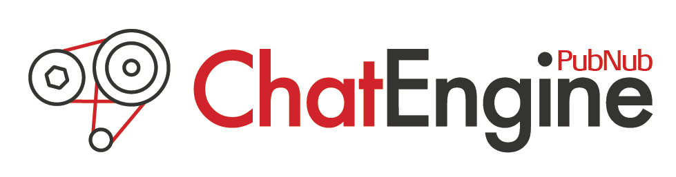

PubNub ChatEngine is an object oriented event emitter based framework for building chat applications in Javascript. It reduces the time to build chat applications drastically and provides essential components like typing indicators, online presence monitoring and message history out of the box.

The real time server component is provided by PubNub. ChatEngine is designed to be extensible and includes a plugin framework to make adding new features simple.

# Getting Started

[](https://travis-ci.org/pubnub/chat-engine)
[](https://www.codacy.com/app/PubNub/chat-engine?utm_source=github.com&utm_medium=referral&utm_content=pubnub/chat-engine&utm_campaign=badger)
[](https://www.codacy.com/app/PubNub/chat-engine?utm_source=github.com&utm_medium=referral&utm_content=pubnub/chat-engine&utm_campaign=badger)

Check out [the getting started guide](https://github.com/pubnub/chat-engine-tutorial).

#   Docs

You can find the full docs on [the full documentation website](https://chat-engine-docs.surge.sh/docs/).

# Examples

## SDKs

### Javascript

* [Chat](https://github.com/pubnub/chat-engine-examples/blob/master/javascript/chat.html)
* [Online List](https://github.com/pubnub/chat-engine-examples/blob/master/javascript/online-list.html)
* [Friends List](https://github.com/pubnub/chat-engine-examples/blob/master/javascript/friends-list.html)

### jQuery

* [jQuery Simple](https://github.com/pubnub/chat-engine-examples/tree/master/jquery/simple)
* [jQuery Kitchen Sink](https://github.com/pubnub/chat-engine-examples/tree/master/jquery/kitchen-sink)

### Angular

* [Angular Simple](https://github.com/pubnub/chat-engine-examples/tree/master/angular/simple)
* [Angular Kitchen Sink](https://github.com/pubnub/chat-engine-examples/tree/master/angular/flowtron)

### React

* [React](https://github.com/pubnub/chat-engine-examples/tree/master/react)

## 3rd Party Authentication

* [Facebook Login](https://github.com/pubnub/chat-engine-examples/blob/master/javascript/facebook-login.html)

## NodeJS + Chatbot

* [NodeJS ChatBot](https://github.com/pubnub/chat-engine-examples/blob/master/nodejs/bot.js)

## Plugins

Check out the [jQuery Kitchen Sink](https://github.com/pubnub/chat-engine-examples/tree/master/jquery/kitchen-sink) and [Angular Kitchen Sink](https://github.com/pubnub/chat-engine-examples/tree/master/angular/flowtron) examples to see plugins in action.

- [Typing Indicator](https://github.com/pubnub/chat-engine-typing-indicator)
- [Event Status and Read Receipts](https://github.com/pubnub/chat-engine-event-status)
- [Mute Users](https://github.com/pubnub/chat-engine-muter)
- [Random Usernames](https://github.com/pubnub/chat-engine-random-username)
- [Desktop Notifications](https://github.com/pubnub/chat-engine-desktop-notifications)
- [Online User Search](https://github.com/pubnub/chat-engine-online-user-search)
- [Image Uploads](https://github.com/pubnub/chat-engine-uploadcare)
- [Persistent Message History](https://github.com/pubnub/chat-engine-history)
- [Markdown Support](https://github.com/pubnub/chat-engine-markdown)
- [Emoji Support](https://github.com/pubnub/chat-engine-emoji)
- [Unread Messages](https://github.com/pubnub/chat-engine-unread-messages)
- [Gravatar Support](https://github.com/pubnub/chat-engine-gravatar)

## Other usage examples

The integration tests in ```test/integration``` includes some usage examples.

# Development

## Cloning

Clone repos (chat-engine and plugins).

All repos should be siblings of one another. This is required for rendering docs
properly.

```
chat-engine
chat-engine-desktop-notifications
chat-engine-emoji
chat-engine-examples
//...
```

## Setting up environment

```
nvm use v6
```

run ```http-server``` from my ```/development``` directory which has all chat-engine repos:


```cd chat-engine```

```node server.js```

load http://localhost:8080 in browser and navigate to /chat-engine-examples/jquery/kitchen-sink

## Compiling

Run ```gulp``` to compile, but you should probably run ```gulp watch``` to get consistent changes.

## Running Tests

Run ```gulp test```.

## Releasing a patch (chat engine and plugins)

```
npm version patch && git push origin master --tags
```
